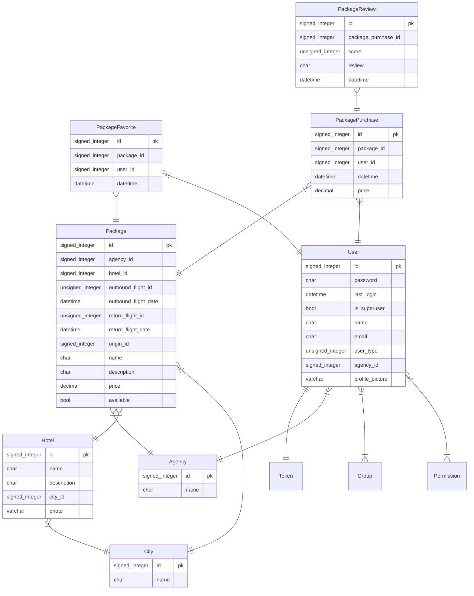

```mermaid
erDiagram
User {
  signed_integer id pk
  char password
  datetime last_login
  bool is_superuser
  char name
  char email
  unsigned_integer user_type
  signed_integer agency_id
  varchar profile_picture
}
Agency {
  signed_integer id pk
  char name
}
City {
  signed_integer id pk
  char name
}
Hotel {
  signed_integer id pk
  char name
  char description
  signed_integer city_id
  varchar photo
}
Package {
  signed_integer id pk
  signed_integer agency_id
  signed_integer hotel_id
  unsigned_integer outbound_flight_id
  datetime outbound_flight_date
  unsigned_integer return_flight_id
  datetime return_flight_date
  signed_integer origin_id
  char name
  char description
  decimal price
  bool available
}
PackageFavorite {
  signed_integer id pk
  signed_integer package_id
  signed_integer user_id
  datetime datetime
}
PackagePurchase {
  signed_integer id pk
  signed_integer package_id
  signed_integer user_id
  datetime datetime
  decimal price
}
PackageReview {
  signed_integer id pk
  signed_integer package_purchase_id
  unsigned_integer score
  char review
  datetime datetime
}
Hotel }|--|| City: ""
PackageReview }|--|| PackagePurchase: ""
PackageFavorite }|--|| Package: ""
PackageFavorite }|--|| User: ""
PackagePurchase }|--|| Package: ""
PackagePurchase }|--|| User: ""
Package }|--|| Agency: ""
Package }|--|| Hotel: ""
Package }|--|| City: ""
User ||--|| Token: ""
User }|--|| Agency: ""
User }|--|{ Group: ""
User }|--|{ Permission: ""
```
